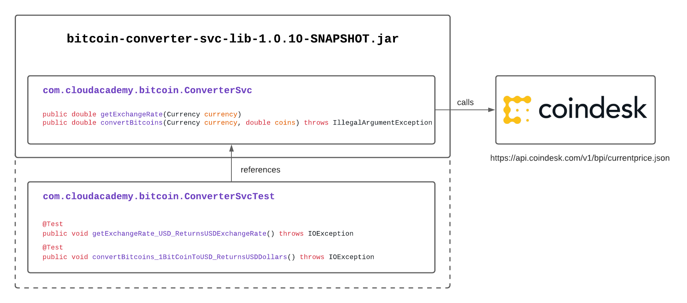

# Java JDK11 TDD Bitcoin Converter

  [](https://coveralls.io/github/cloudacademy/java-tdd-bitcoinconverter?branch=main)

## Background
The following repo contains source code developed using TDD (Test Driven Development) practices. The sample project implements a Java (JDK 11) library which interacts with the [Bitcoin Price Index](https://www.coindesk.com/coindesk-api) api.

:metal:



Note: If you intend to follow along and complete the full demonstration then please fork or setup a new GitHub repo - as step 6 will require you to create a GitHub Secret to store the [Coveralls](https://coveralls.io/) project token. Coveralls is used to create code coverage reports and visuals. 

## Prerequisites
**JDK11** and **Maven3** are required for this project. 

All provided sample code and instructions have been tested with the following versions:

* JDK11

```
java -version
openjdk version "11.0.9" 2020-10-20
OpenJDK Runtime Environment (build 11.0.9+11)
OpenJDK 64-Bit Server VM (build 11.0.9+11, mixed mode)
```

* Maven3

```
mvn --version
Apache Maven 3.6.3 (cecedd343002696d0abb50b32b541b8a6ba2883f)
Maven home: /usr/local/Cellar/maven/3.6.3_1/libexec
Java version: 14.0.1, vendor: N/A, runtime: /usr/local/Cellar/openjdk/14.0.1/libexec/openjdk.jdk/Contents/Home
Default locale: en_NZ, platform encoding: UTF-8
OS name: "mac os x", version: "10.15.7", arch: "x86_64", family: "mac"
```

## Tools and Frameworks
The following tools and frameworks have been used to perform the TDD developement:

* [Maven](http://maven.apache.org/) - used to provide build and test project automation and management
* [JUnit5](https://junit.org/junit5/) - a unit testing framework, used to implement unit tests
* [Mockito](https://site.mockito.org/) - a mocking library, used to create mocks for external dependencies
* [GitHub Actions](https://github.com/features/actions) - used to provide CICD features for automated building and testing
* [Coveralls](https://coveralls.io/) - used to provide unit test code coverage reports

## JDK11 and JUnit5 Maven Archetype
The following custom Maven Archetype has been made available - this can used to create new JDK11 and JUnit5 based projects:

https://github.com/cloudacademy/java11-junit5-archetype

## Repo Branches
Branches are used within this repo to demonstrate the TDD workflow (red, green, refactor), as well as highlighting other project management configuration areas. These branches allow you to quickly jump ahead to the area of interest:

### Branches
* [step1](https://github.com/cloudacademy/java-tdd-bitcoinconverter/tree/step1) - demonstrates how to setup the initial project structure with the first set of unit tests using JUnit5 and the ```@Test``` annotation, uses a fake implementation of the Bitcoin Price Index API

* [step2](https://github.com/cloudacademy/java-tdd-bitcoinconverter/tree/step2) - refactors current unit tests and codebase to call the real Bitcoin Price Index API using the Apache HttpClient for HTTP access - the tests in this step will fail, this introduces you to the next step (mocks)

* [step3](https://github.com/cloudacademy/java-tdd-bitcoinconverter/tree/step3) - introduces Mockito and refactors current unit tests to mock the Apache HttpClient HTTP calls to the Bitcoin Price Index API

* [step4](https://github.com/cloudacademy/java-tdd-bitcoinconverter/tree/step4) - refactors the unit tests and codebase to add addtional unit tests to test error conditions

* [step5](https://github.com/cloudacademy/java-tdd-bitcoinconverter/tree/step5) - adds in a GitHub Action workflow to perform automatic build and tests on push events - produces a jar artifact

* [step6](https://github.com/cloudacademy/java-tdd-bitcoinconverter/tree/step6) - refactors the single GitHub Action workflow into seperate Dev and Prod GitHub Action workflows - the Dev workflow generates a unit test code coverage report and forwards it automatically into https://coveralls.io/ for viewing and analysis - the Prod workflow is used to produce releases

* [step7](https://github.com/cloudacademy/java-tdd-bitcoinconverter/tree/step7) - introduces a client console project to test the GitHub Action built jar library artifact

**Note**: The [main](https://github.com/cloudacademy/java-tdd-bitcoinconverter/tree/main) branch (this branch) contains the same code and configuration as contained in the [step7](https://github.com/cloudacademy/java-tdd-bitcoinconverter/tree/step7) branch

## Bitcoin Converter Library
This project builds a Java library which contains the following 2 public methods:
```java
public double getExchangeRate(Currency currency)
```
returns in realtime the current Bitcoin exchange rate for the given currency (USD, GBP, or EUR)

```java
public double convertBitcoins(Currency currency, double coins) throws IllegalArgumentException
```
returns the dollar value for the given currency (USD, GBP, or EUR), and the number of Bitcoins

To build the Bitcoin Converter Library perform the following commands:

```
mvn clean compile test package
```

## Bitcoin Converter Client
This project also contains a sample [client](https://github.com/cloudacademy/java-tdd-bitcoinconverter/tree/main/client) console based application - which imports the Bitcoin Converter library. To build and run the client perform the following commands:

```bash
#build/package executable jar
cd client
FILE=bitcoin-converter-svc-lib-1.0.9-SNAPSHOT.jar
VERSION=`echo $FILE | egrep -o '\d*\.\d*\.\d*\-\w*'`
mvn install:install-file -Dfile=./libs/$FILE -DgroupId=com.cloudacademy -DartifactId=bitcoin-converter-svc-lib -Dversion=$VERSION -Dpackaging=jar
mvn clean package

#run executable jar:
java -jar target/bitcoin-converter-client-1.0.0-SNAPSHOT-jar-with-dependencies.jar
```

## GitHub Action - CICD
This project demonstrates how to use [GitHub Actions](https://github.com/cloudacademy/java-tdd-bitcoinconverter/tree/main/.github/workflows) to perform automated builds, testing, packaging, and releases.

### dev.build.yml
```
name: Java CI Dev

on:
  push:
    branches: main

jobs:
  build:
    runs-on: ubuntu-latest

    steps:
      - uses: actions/checkout@v2

      - name: JDK 1.11 Install
        uses: actions/setup-java@v1
        with:
          java-version: 11

      - name: Maven Build
        run: |
          mvn -B clean package
          mkdir staging
          cp target/*.jar staging

      - name: Code Coverage
        run: |
          mvn -B jacoco:prepare-agent clean test jacoco:report coveralls:report -Dcoveralls.secret=${{ secrets.COVERALLS }}

      - name: Artifact Upload
        uses: actions/upload-artifact@v2
        with:
          name: Package
          path: staging
```

### prod.build.yml
```
name: Java CI Prod

on:
  push:
    tags:
      - '*'

jobs:
  build:
    runs-on: ubuntu-latest

    steps:
      - uses: actions/checkout@v2

      - name: JDK 1.11 Install
        uses: actions/setup-java@v1
        with:
          java-version: 11

      - name: Maven Build
        run: |
          mvn versions:set -DremoveSnapshot
          mvn -B clean package test
          mkdir release
          cp target/*.jar release

      - name: Artifact Upload
        uses: actions/upload-artifact@v2
        with:
          name: Package
          path: release

      - name: Make Release
        uses: softprops/action-gh-release@v0.1.5
        with:
          files:
            target/*.jar
        env:
          GITHUB_TOKEN: ${{ secrets.GITHUB_TOKEN }}
```

## Coveralls - Code Coverage Report
This project forwards its unit testing code coverage reports to [coveralls.io](https://coveralls.io/github/cloudacademy/java-tdd-bitcoinconverter) for report viewing and analysis

## Vagrant
The provided [Vagrantfile](https://github.com/cloudacademy/java-tdd-bitcoinconverter/blob/main/Vagrantfile) can be used to spin up an Ubuntu 18.04 instance, which is bootstrapped to install both OpenJDK 11 and Maven 3.6.3:

```
$bootstrap = <<SCRIPT
export DEBIAN_FRONTEND=noninteractive
export APT_KEY_DONT_WARN_ON_DANGEROUS_USAGE=1
apt-get update
apt-get install -y tree
echo ========================
echo installing openjdk-11-jdk...
apt-get install -y openjdk-11-jdk
echo ========================
echo installing maven 3.6.3...
cd /tmp
curl -OLs --output /dev/null https://www-us.apache.org/dist/maven/maven-3/3.6.3/binaries/apache-maven-3.6.3-bin.tar.gz
tar xf /tmp/apache-maven-*.tar.gz -C /opt
ln -s /opt/apache-maven-3.6.3 /opt/maven
cat <<EOF >> /etc/profile.d/maven.sh
export JAVA_HOME=/usr/lib/jvm/java-1.11.0-openjdk-amd64
export M2_HOME=/opt/maven
export MAVEN_HOME=/opt/maven
export PATH=/opt/maven/bin:${PATH}
EOF
chmod +x /etc/profile.d/maven.sh
source /etc/profile.d/maven.sh
echo ========================
echo finished!!
SCRIPT

Vagrant.configure("2") do |config|
  config.vm.box = "ubuntu/bionic64"
  config.vm.provision "shell", inline: $bootstrap
end
```

Use the following Vagrant command to launch the instance:

```
vagrant up
```

Then SSH into the instance by running the following command:

```
vagrant ssh
```

To confirm that both the OpenJDK 11 JDK and Maven 3.6.3 have been installed successfully by the boostrapping, run the following command:

```
java -version
mvn -version
```

Back on your local workstation, you can use Visual Studio Code or any other editor to open and modify the contents of the current folder - with all changes being automatically synced back into the ```/vagrant``` directory within the Vagrant instance.
